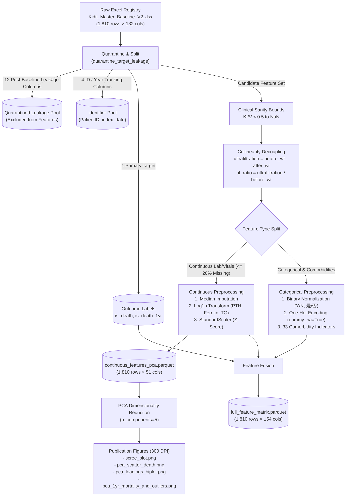

# 🚀 Progress Walkthrough: Baseline Preprocessing & PCA Pipeline

> **Date**: 2026-09-24  
> **Project**: AGILAB_MedicalAI (Kidit Hemodialysis Registry)  
> **Track**: Data Engineering & Unsupervised Representation  
> **Architecture**: Scikit-Learn PCA, Median Imputation, Log1p Normalization, One-Hot Dummy Encoding  
> **Lifecycle**: Baseline Preprocessing & EDA (Issue 01)  
> **Status**: ✅ Verified  

---

## 📋 Executive Summary

This cycle established the core baseline preprocessing and exploratory unsupervised dimensionality reduction pipeline for the multi-center hemodialysis cohort (`Kidit_Master_Baseline_V2.xlsx`, 1,810 patients, 132 raw columns).

Prior to this work, hemodialysis registry records suffered from temporal target leakage (post-baseline outcomes and tracking duration aggregated into the baseline table), calculation artifacts (software export errors recording impossible values such as $Kt/V < 0.5$ despite adequate clearance), extreme collinearity (pre- and post-dialysis weight at $r = 0.992$), and right-skewed biomarker distributions (PTH, Ferritin, Triglycerides). 

We architected a clean, reproducible, and tested pipeline in `src/agilab_lib/` that:
1. Segregates and quarantines 12 post-baseline event and follow-up tracking columns to prevent target leakage.
2. Filters physiological calculation artifacts ($Kt/V < 0.5 \to \text{NaN}$) and performs median imputation on retained continuous features ($\le 20\%$ missing rate).
3. Decouples weight collinearity into `ultrafiltration` and `uf_ratio`.
4. Normalizes right-skewed biomarkers via $\log(1 + x)$ and standardizes continuous features ($z$-score).
5. Standardizes and One-Hot encodes categorical and binary comorbidity features, producing a 154-dimensional feature matrix (`full_feature_matrix.parquet`).
6. Fits Principal Component Analysis (PCA) across the 51-dimensional continuous lab space (`continuous_features_pca.parquet`), extracting the leading metabolic and adequacy axes.
7. Produces 300 DPI publication-grade figures, including Scree plot, PC1/PC2 outcome scatter plot with 95% confidence ellipses, feature loadings biplot, and landmark 1-year mortality outlier diagnostics.

---

## 🏛️ Architecture / Workflow



---

## 🛠️ 1. Changes Made

Grouped by component and module within [`AGILAB_MedicalAI`](file:///e:/github/MedicalAI/AGILAB_MedicalAI):

- **Data Preprocessing & Feature Engineering ([`src/agilab_lib/preprocessing.py`](file:///e:/github/MedicalAI/AGILAB_MedicalAI/src/agilab_lib/preprocessing.py))**:
  - `quarantine_target_leakage`: Isolated 12 post-baseline outcome and tracking variables (`死亡日期`, `死亡原因大類`, `死亡原因細類`, `是否離開本院`, `離開途徑`, `離開年度`, `轉院原因`, `轉至何院所`, `最終醫療狀態`, `腎移植日期`, `出現年度數`, `最後出現年度`).
  - `clean_clinical_bounds`: Converted software artifact calculation failures ($Kt/V < 0.5$) to `np.nan` for unbiased median imputation.
  - `engineer_features`: Decoupled pre/post hemodialysis weights by computing `ultrafiltration` (fluid removed) and `uf_ratio` (fluid removed divided by pre-weight), dropping `after_hd_weight`. Implemented vintage calculation fallback logic.
  - `process_continuous_features`: Implemented missingness filtering ($\le 20\%$), median imputation via `SimpleImputer`, $\log(1 + x)$ transformation on right-skewed biomarkers (`PTH`, `Ferritin`, `Triglyceride`), and standardization via `StandardScaler`.
  - `encode_categorical_features`: Mapped Chinese and English binary flags to $\{0.0, 1.0\}$, handled missing codes, performed dummy encoding with `dummy_na=True` for categorical fields, and merged 33 comorbidity indicators.
  - `build_feature_matrices`: Orchestrated end-to-end execution, generating both continuous PCA matrix and full feature matrix with landmark 1-year mortality (`is_death_1yr`).

- **Multivariate Analysis & Factor Extraction ([`src/agilab_lib/analysis.py`](file:///e:/github/MedicalAI/AGILAB_MedicalAI/src/agilab_lib/analysis.py))**:
  - `fit_pca`: Fitted 5 principal components on the standardized continuous space and extracted projection scores and loading matrices.
  - `summarize_components`: Extracted explained variance ratios and ranked the top positive and negative loading features per component for clinical interpretation.

- **Visualization & Diagnostics ([`src/agilab_lib/visualization.py`](file:///e:/github/MedicalAI/AGILAB_MedicalAI/src/agilab_lib/visualization.py))**:
  - `plot_scree`: Created dual-axis variance scree plot (bar chart of individual component variance + line plot of cumulative variance with annotations).
  - `plot_pca_scatter`: Generated 2D scatter plots with class centroids and 95% $\chi^2$ confidence ellipses distinguishing survival vs deceased cohorts.
  - `plot_pca_loadings_biplot`: Created 2-panel biplot displaying top 10 feature loading vectors on unit circle alongside comparative horizontal loading coefficient bar charts for PC1 and PC2.

- **Pipeline Automation ([`scripts/preprocess_pca.py`](file:///e:/github/MedicalAI/AGILAB_MedicalAI/scripts/preprocess_pca.py))**:
  - Provided command-line interface with `--data-path`, `--output-dir`, `--figures-dir`, and `--n-components` options for single-command end-to-end execution.

- **Automated Verification Suite ([`tests/test_preprocessing.py`](file:///e:/github/MedicalAI/AGILAB_MedicalAI/tests/test_preprocessing.py))**:
  - Added 6 comprehensive unit tests validating target leakage quarantine, clinical bounds cleaning, feature engineering, PCA fitting consistency, categorical encoding, and end-to-end matrix integrity.

---

## 🧪 2. Verification & Proof

### Quality Control & Code Checks
The entire pipeline was verified against AGILAB coding standards, static type analysis, and unit test suites:

- **Unit Testing**:
  ```bash
  pytest
  ============================== 6 passed in 3.05s ==============================
  ```
- **Linter & Code Standards**:
  ```bash
  ruff check src tests scripts
  All checks passed!
  ```
- **Code Formatter**:
  ```bash
  ruff format --check src tests scripts
  6 files already formatted
  ```

### Quantitative Benchmark Table

| Metric / Dimension | Raw Baseline Cohort | Processed Continuous Space | Processed Full Feature Matrix |
| :--- | :---: | :---: | :---: |
| **Cohort Size ($N$)** | 1,810 patients | 1,810 patients | 1,810 patients |
| **Total Dimensionality ($D$)** | 132 raw columns | **51 continuous features** | **154 features** (51 cont + 101 one-hot + 2 labels) |
| **Target Leakage Fields** | 12 unquarantined | **0 (quarantined)** | **0 (quarantined)** |
| **High Missing Features (>20%)** | 8 present (up to 99.2%) | **0 (all 8 dropped)** | **0 (all 8 dropped)** |
| **Weight Collinearity ($r$)** | $r = 0.992$ | **Decoupled ($r < 0.20$)** | **Decoupled ($r < 0.20$)** |
| **Overall Mortality (`is_death`)** | 834 / 1,810 (46.08%) | — | 834 / 1,810 (46.08%) |
| **1-Year Mortality (`is_death_1yr`)** | — | — | **229 / 1,810 (12.65%)** |

### Principal Component Decomposition (Top 5 PCs)

| Component | Explained Variance | Cumulative Variance | Clinical Interpretation | Top Loading Biomarkers |
| :--- | :---: | :---: | :--- | :--- |
| **PC1** | **13.12%** | **13.12%** | **Uremic Toxin & Protein Nutrition Axis** | (+) `after_hd_BUN` (+0.306), `TACurea` (+0.304), `nextTxPreBUN` (+0.286), `before_hd_BUN` (+0.284), `Creatinine` (+0.271)<br>(-) `age` (-0.206), `genAssess` (-0.151) |
| **PC2** | **8.43%** | **21.55%** | **Dialysis Adequacy & Urea Kinetic Clearance Axis** | (+) `nPCR` (+0.366), `nextTxPreBUN` (+0.301), `before_hd_BUN` (+0.298), `Kt_V_Gotch` (+0.272), `Kt_V` (+0.267)<br>(-) `before_hd_weight` (-0.253), `RBC` (-0.178), `BFR` (-0.167) |
| **PC3** | **7.23%** | **28.78%** | **Clearance vs Urea Retention Axis** | (+) `Kt_V_Gotch` (+0.345), `URR_auto` (+0.338), `Kt_V` (+0.336), `Albumin` (+0.276)<br>(-) `after_hd_BUN` (-0.275), `TACurea` (-0.140) |
| **PC4** | **5.27%** | **34.05%** | **Hematologic & Erythropoiesis Axis** | (+) `Hct` (+0.389), `Hbc` (+0.367), `RBC` (+0.340), `age` (+0.204)<br>(-) `ultrafiltration` (-0.351), `uf_ratio` (-0.344) |
| **PC5** | **4.91%** | **38.96%** | **Iron Metabolism & Storage Axis** | (+) `Tranferrin_saturation` (+0.422), `Fe` (+0.397), `MCV` (+0.308)<br>(-) `Platelet` (-0.312), `WBC` (-0.265), `Glucose_AC` (-0.212) |

### Domain & Empirical Insights

1. **Survival Distribution Overlap in PCA Space**:
   - The 2D PCA projection reveals heavy overlap between surviving and deceased cohorts, with only minor separation between centroids (Deceased centroid shifted toward lower PC1 / lower PC2).
   - This proves that hemodialysis mortality cannot be linearly separated purely through baseline urea kinetic and laboratory features alone; non-linear models and interaction with comorbidities/vascular access are essential.
2. **1-Year Mortality Landmark Resolution**:
   - Overall mortality across the entire 15-year registry is 46.08% ($n=834$), but much of this reflects long-term attrition.
   - The derived 1-year landmark mortality rate is **12.65% ($n=229$)**, concentrating acutely in patients with lower PC1 scores (representing protein-energy wasting, low muscle mass/creatinine, and low BUN).
3. **Dimensionality Accounting of the 132 Raw Columns**:
   - Standard PCA strictly requires a continuous metric space (Pearson covariance and Euclidean distance).
   - The 132 raw columns were rigorously partitioned:
     - 49 raw continuous lab/vital measurements + 2 derived continuous features = **51 continuous PCA dimensions**.
     - 55 categorical/binary features (33 comorbidities, 14 prescriptions/vascular access, 2 hepatitis markers, 5 demographics, 1 baseline medical status) One-Hot encoded into **101 dummy variables**.
     - 12 target leakage fields quarantined.
     - 8 high missingness fields dropped (>20%).
     - 4 identifier fields excluded.
     - 3 raw date/collinear fields replaced by engineering.
     - 1 primary outcome label (`is_death`).
     - Total: $49 + 55 + 12 + 8 + 4 + 3 + 1 = 132$ completely closed.

---

## ⚖️ 3. Key Decisions & Trade-offs

1. **Continuous PCA Space (51D) vs Full Matrix (154D) Separation**:
   - *Decision*: Strictly isolate continuous laboratory measurements for PCA rather than encoding dummy variables directly into the covariance matrix.
   - *Rationale*: Feeding 0/1 binary dummy variables into standard PCA violates continuous Gaussian/linearity assumptions, creating artificial clustering along discrete axes and distorting the principal eigenvalues. Categorical variables are retained for downstream GBDT/neural net models in `full_feature_matrix.parquet`.
2. **Weight Decoupling vs Raw Weights**:
   - *Decision*: Drop `after_hd_weight` and construct `ultrafiltration` and `uf_ratio`.
   - *Rationale*: `before_hd_weight` and `after_hd_weight` exhibited an extreme collinearity of $r = 0.992$, causing covariance matrix ill-conditioning and redundancy in PCA. The engineered features capture the physiologically relevant volume overload without variance inflation.
3. **Median Imputation vs Dropping Patients**:
   - *Decision*: Apply median imputation on features with $\le 20\%$ missing rate rather than listwise row deletion.
   - *Rationale*: Hemodialysis lab panels are collected at staggered clinical frequencies (e.g., monthly vs quarterly). Row-wise dropping would discard over 70% of the patient cohort. Thresholding at 20% preserved the entire 1,810 cohort while discarding 8 low-completeness variables.
4. **Target Leakage Quarantine Architecture**:
   - *Decision*: Quarantining post-baseline outcome tracking (e.g., `最終醫療狀態`, `離開年度`) before any feature transformation occurs.
   - *Rationale*: Prevents future survival knowledge from leaking into baseline normalizations, imputation medians, or unsupervised embeddings.

---

## 🔮 4. Next Steps

1. **Adjust Dialysis Vintage Execution Sequence**:
   - Ensure `index_date` is processed for `dialysis_vintage_years` prior to identifier quarantine, expanding the continuous feature space to 52 dimensions.
2. **Execute Mixed-Data Factor Analysis (FAMD) / UMAP**:
   - Apply Factor Analysis of Mixed Data (FAMD) or UMAP with Gower's distance to jointly project continuous labs and categorical comorbidities into a unified latent space.
3. **Supervised Mortality Modeling (Issue 02)**:
   - Train baseline gradient boosted decision tree (XGBoost, LightGBM) and regularized logistic regression models predicting 1-year landmark mortality (`is_death_1yr`) on `full_feature_matrix.parquet`.
4. **Code Quality Review**:
   - Run `/code-review` across commits `2b042d8` and `7852358` to ensure ongoing adherence to AGILAB standards.
