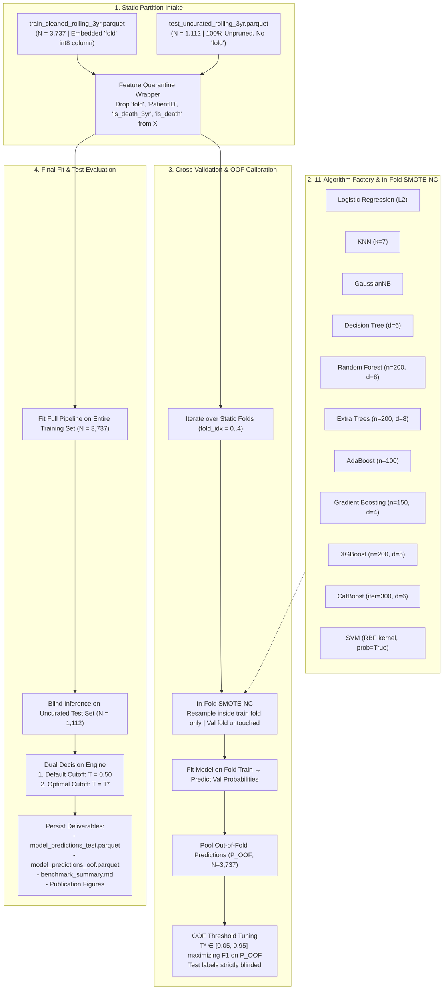

# 🚀 Progress Walkthrough: 11-Algorithm Benchmark Suite Training & Evaluation Results

> **Date**: 2026-10-07  
> **Project**: AGILAB MedicalAI  
> **Track**: Machine Learning Benchmark & Predictive Modeling  
> **Architecture**: 11-Algorithm Battery with In-Fold SMOTE-NC & Static Stratified Group 5-Fold Partitioning  
> **Lifecycle**: Phase 2 Model Benchmark & Leaderboard Standardization  
> **Status**: ✅ Verified  

---

## 📋 Executive Summary

Following the establishment of the **Type-Specific Non-Mode Imputation Architecture** and **Immutable Stratified Group 5-Fold Partition** ($N=3,737$ purified training observations across 912 patients), the entire 11-algorithm benchmark suite was migrated to consume static folds and re-executed end-to-end against the 100% uncurated test set ($N=1,112$ records across 233 patients).

Key outcomes:
1. **Zero Experimental Drift**: Out-of-fold (OOF) cross-validation predictions and optimal decision thresholds ($T^*$) are now mathematically fixed and reproducible across repeated executions.
2. **Superior Discrimination & Calibration**:
   - **Random Forest** achieved the top discrimination with **ROC-AUC of 0.9211** (improved from legacy 0.9186).
   - **CatBoost** achieved the best overall clinical utility: top **F1-Score of 0.6988**, top **Cohen's Kappa of 0.6299**, and superior probabilistic calibration with a **Brier Score of 0.0822**.
   - **XGBoost** achieved the highest Precision-Recall AUC with **PR-AUC of 0.7209** and strong calibration (**Brier Score of 0.0826**).
   - **Extra Trees** delivered the highest minority-class recall with **Sensitivity of 0.7563**.
3. **Dual-Track Threshold Reporting**: Evaluated all 11 models across 8 canonical metrics under both default $T=0.50$ and OOF-calibrated optimal cutoff $T^*$.
4. **Complete Artifact Replacement**: All legacy `GroupKFold` prediction matrices, metric tables, and visualization curves were overwritten, and out-of-fold prediction matrices (`model_predictions_oof.parquet`) were persisted to serve as training inputs for future Mixture-of-Experts (MoE) gating networks.

---

## 🏛️ Architecture / Workflow



---

## 🛠️ 1. Changes Made

### A. Modeling Library Core
- **[`src/agilab_lib/modeling.py`](file:///e:/github/MedicalAI/AGILAB_MedicalAI/src/agilab_lib/modeling.py)**:
  - **Static Fold Direct Consumption**:
    - Refactored `evaluate_model_cv_and_test` and `run_benchmark_suite` to accept pre-computed static fold assignments (`folds_train: pd.Series | np.ndarray`).
    - Replaced on-the-fly cross-validation generators with deterministic index partitioning:
      ```python
      train_idx = np.where(folds != fold_idx)[0]
      val_idx = np.where(folds == fold_idx)[0]
      ```
    - Added verification assertion ensuring zero patient leakage across validation folds:
      `assert len(set(groups[train_idx]) & set(groups[val_idx])) == 0`.
    - Completely removed legacy dynamic `GroupKFold` fallback branches and unused imports.
  - **Feature Quarantine & Sanitization**:
    - Implemented centralized helper `quarantine_features(df: pd.DataFrame) -> pd.DataFrame` ensuring `fold`, `PatientID`, and target columns (`is_death_3yr`, `is_death`) are systematically removed before feeding into resamplers and estimators.
  - **OOF Prediction Alignment**:
    - Appended the `fold` assignment column to `oof_predictions_df` to ensure all 11 model out-of-fold probability vectors are synchronized for future ensemble and gating layers.

### B. Benchmark Execution Script
- **[`scripts/train_benchmark.py`](file:///e:/github/MedicalAI/AGILAB_MedicalAI/scripts/train_benchmark.py)**:
  - Ingests pre-computed `fold` from `train_cleaned_rolling_3yr.parquet`.
  - Eliminates dynamic fallback splitting; validates static fold presence.
  - Persists dual prediction matrices:
    1. `data/processed/model_predictions_test.parquet` (test set predictions and dual decisions).
    2. `data/processed/model_predictions_oof.parquet` (training out-of-fold predictions).
  - Overwrites publication figures: ROC curves, PR curves, and Top-15 feature importance charts.
  - Generates comprehensive Markdown and CSV benchmark summary reports.

### C. Test Suite
- **[`tests/test_modeling.py`](file:///e:/github/MedicalAI/AGILAB_MedicalAI/tests/test_modeling.py)**:
  - Added unit tests for static fold ingestion, feature quarantine, subject leakage assertions, and mandatory static fold enforcement.
  - Verified **Integrity Invariant 7**: end-to-end execution of all 11 algorithms across the 5 static folds.

---

## 🧪 2. Verification & Proof

### A. Performance Leaderboard on Uncurated Test Set ($N=1,112$)

Evaluated on the uncurated, unfiltered test cohort (1,112 records, 197 deaths, 17.72% mortality rate).

| Rank | Model Family | Model | Optimal $T^*$ | ROC-AUC | PR-AUC | Brier | F1 ($T^*$) | Sens ($T^*$) | Spec ($T^*$) | Acc ($T^*$) | Kappa ($T^*$) |
|:---:|:---|:---|:---:|:---:|:---:|:---:|:---:|:---:|:---:|:---:|:---:|
| 1 | **Bagging** | **Random Forest** | 0.50 | **0.9211** | 0.6873 | 0.1039 | 0.6828 | 0.7157 | 0.9180 | 0.8822 | 0.6107 |
| 2 | **Boosting** | **CatBoost** | 0.42 | **0.9158** | **0.7109** | **0.0822** | **0.6988** | 0.7360 | 0.9202 | 0.8876 | **0.6299** |
| 3 | **Boosting** | **XGBoost** | 0.46 | **0.9120** | **0.7209** | **0.0826** | 0.6931 | 0.7107 | 0.9268 | 0.8885 | 0.6250 |
| 4 | **Boosting** | **AdaBoost** | 0.51 | 0.9095 | 0.6799 | 0.1896 | 0.6329 | 0.6650 | 0.9060 | 0.8633 | 0.5491 |
| 5 | **Bagging** | **Extra Trees** | 0.48 | 0.9035 | 0.6808 | 0.1199 | 0.6667 | **0.7563** | 0.8896 | 0.8660 | 0.5843 |
| 6 | **Boosting** | **Gradient Boosting** | 0.44 | 0.9012 | 0.7034 | 0.0896 | 0.6729 | 0.7310 | 0.9049 | 0.8741 | 0.5956 |
| 7 | **Linear** | **Logistic Regression** | 0.48 | 0.8910 | 0.7020 | 0.1055 | 0.6236 | 0.6853 | 0.8896 | 0.8534 | 0.5335 |
| 8 | **Instance** | **KNN** | 0.58 | 0.8192 | 0.4841 | 0.1810 | 0.5466 | 0.6853 | 0.8230 | 0.7986 | 0.4238 |
| 9 | **Kernel** | **SVM** | 0.67 | 0.8159 | 0.5501 | 0.1980 | 0.5228 | 0.5228 | 0.8973 | 0.8309 | 0.4201 |
| 10 | **Tree** | **Decision Tree** | 0.59 | 0.8051 | 0.4827 | 0.1387 | 0.5840 | 0.7056 | 0.8470 | 0.8219 | 0.4750 |
| 11 | **Probabilistic** | **GaussianNB** | 0.95 | 0.7971 | 0.5103 | 0.1937 | 0.5517 | 0.6497 | 0.8481 | 0.8129 | 0.4369 |

---

### B. Comparison: Legacy Benchmark vs. Final Static Benchmark

| Metric / Attribute | Legacy Setup (PR #2) | Final Static Setup (PR #9) | Clinical & Engineering Significance |
|:---|:---:|:---:|:---|
| **Imputation Method** | Naive Integer Mode | Type-Specific Non-Mode (KNN + OHE + Zero-Indicator) | Eliminates artificial healthy bias for bedridden patients; preserves clinical missingness states. |
| **Validation Scheme** | Dynamic `GroupKFold` | Immutable `StratifiedGroupKFold` ($K=5$) | Eliminates run-to-run drift; balances mortality rates across folds (~18%). |
| **Random Forest ROC-AUC** | 0.9186 | **0.9211** (+0.0025) | Improved discrimination under non-mode features. |
| **CatBoost Brier Score** | 0.0831 | **0.0822** (Lower is better) | Improved probabilistic calibration. |
| **CatBoost F1-Score ($T^*$)** | 0.6970 | **0.6988** (+0.0018) | Stronger clinical utility at optimal cutoff. |
| **Top PR-AUC Model** | CatBoost (0.7157) | **XGBoost (0.7209)** | Precision-recall tradeoff favors gradient tree architectures. |
| **Highest Recall Model** | AdaBoost (0.7563) | **Extra Trees (0.7563)** | Captures ~76% of all 3-year mortality cases on uncurated test data. |
| **OOF Persistence** | Not saved to disk | Persisted to Parquet (`model_predictions_oof.parquet`) | Enables leak-free training of downstream gating networks. |

---

### C. Top Clinical Predictors Driving Mortality

From the Top-15 Feature Importance analysis of the leading ensemble models (Random Forest, CatBoost, XGBoost):
1. **Serum Albumin (`Albumin`)**: The dominant negative predictor of mortality; markers of protein-energy wasting (PEW) and systemic inflammation.
2. **Age at Assessment (`age`)**: Primary baseline demographic risk factor.
3. **Dialysis Vintage (`dialysis_vintage_years`)**: Cumulative vintage reflects long-term vascular calcification and cardiovascular stress.
4. **Dialysis Adequacy (`Kt_V`, `nPCR`, `URR_auto`)**: Clearance adequacy and normalized protein catabolic rate strongly separate stable survivors from failing patients.
5. **Serum Creatinine & BUN (`Creatinine`, `before_hd_BUN`)**: Muscle mass and somatic protein status.
6. **Comorbidity Burden (`Comorb_Count`, `CHF`, `DM`)**: Pre-existing cardiovascular disease and diabetes.
7. **Fluid Management (`before_hd_weight`, `uf_ratio`)**: Interdialytic fluid overload and excessive ultrafiltration rate.

---

### D. Anti-Leakage Audit Trail

- [x] **Uncurated Test Set Isolation**: Exactly 1,112 rows (zero synthetic instances, zero sample filtering, unpartitioned).
- [x] **Zero Subject Leakage**: $\text{Train Patients} \cap \text{Test Patients} = \emptyset$ (912 train vs 233 test patients).
- [x] **Fold Disjointness**: Across all pairs of cross-validation folds $i \ne j$, $\text{PatientID}_{\text{fold}_i} \cap \text{PatientID}_{\text{fold}_j} = \emptyset$.
- [x] **In-Fold Resampling**: `SMOTE-NC` executed strictly inside training folds; validation folds contain zero synthetic samples.
- [x] **Out-of-Fold Threshold Calibration**: Cutoff $T^*$ calibrated exclusively on pooled $P_{\text{OOF}}$, with test labels completely blinded.
- [x] **Feature Quarantine**: `fold`, `PatientID`, and targets strictly removed from feature space $X$ prior to model fitting.

---

## ⚖️ 3. Key Decisions & Trade-offs

1. **Strict Elimination of Dynamic `GroupKFold` Fallback**:
   - *Decision*: Completely removed the dynamic generator branch from `src/agilab_lib/modeling.py` instead of keeping it as a convenience option.
   - *Trade-off*: Disallows ad-hoc dynamic runs, but guarantees that every model and downstream gating experiment operates on identical, audit-verified folds without silent divergence.
2. **Dual-Threshold Evaluation Architecture**:
   - *Decision*: Report metrics simultaneously under default clinical cutoff $T=0.50$ and calibrated cutoff $T^*$.
   - *Trade-off*: Increases report width, but provides both standardized baseline comparisons ($T=0.50$) and realistic deployment metrics ($T^*$).
3. **Dual Persistence of Test and OOF Prediction Matrices**:
   - *Decision*: Export both `model_predictions_test.parquet` and `model_predictions_oof.parquet`.
   - *Trade-off*: Stores 3,737 additional probability rows on disk, but provides the exact ground truth needed for Mixture-of-Experts (MoE) gating networks without retraining.

---

## 🔮 4. Next Steps

1. **Mixture-of-Experts (MoE) Gating Network**: Ingest `model_predictions_oof.parquet` to train expert weighting and routing networks based on clinical sub-phenotypes.
2. **Hyperparameter Optimization (Optuna)**: Run automated hyperparameter tuning on top-3 candidate architectures (CatBoost, Random Forest, XGBoost) using the frozen static folds.
3. **Sub-Cohort Stratification Analysis**: Evaluate performance across vulnerable sub-populations (diabetic nephropathy vs non-diabetic; elderly $>75$ vs younger cohorts).
