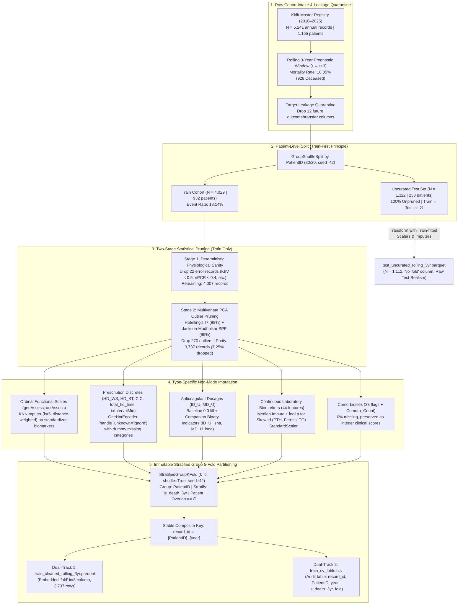

# 🚀 Progress Walkthrough: Hemodialysis Rolling 3-Year Data Preprocessing Pipeline

> **Date**: 2026-10-07  
> **Project**: AGILAB MedicalAI  
> **Track**: Data Engineering & Clinical Preprocessing Pipeline  
> **Architecture**: Type-Specific Non-Mode Imputation & Immutable Stratified Group 5-Fold Partitioning  
> **Lifecycle**: Phase 1 Preprocessing & Partitioning Standardization  
> **Status**: ✅ Verified  

---

## 📋 Executive Summary

Prior iterations of the hemodialysis longitudinal prognosis pipeline suffered from two critical data engineering flaws:
1. **Clinical Distortion from Naive Mode Imputation**: The preprocessing pipeline applied blanket integer mode (眾數) imputation across all discrete clinical variables. This caused severe clinical bias:
   - For ordinal functional scales (`genAssess`, `actAssess`), defaulting unassessed patients (~10% missing) to the mode (7 and 90) artificially branded critically ill, bedridden, or palliative patients as healthy self-caring individuals, drastically underestimating mortality risk.
   - For discrete prescription parameters (`HD_WS`, `HD_ST`, `CIC`, `total_hd_time`, `txIntervalMin`), mode imputation falsely masked non-standard medical orders as majority prescriptions.
   - For zero-inflated anticoagulant dosages (`ID_U`, `MD_U`), mode imputation failed to differentiate between true zero-heparin dialysis and unrecorded documentation.
2. **Dynamic Experimental Variance & Lack of Stratification**: Cross-validation folds were dynamically regenerated via unstratified `GroupKFold` per execution run, creating out-of-fold (OOF) distribution drift and severe event-rate imbalance across folds (12.2% in Fold 0 vs. 22.7% in Fold 2).

This report documents the finalized, verified **Type-Specific Non-Mode Imputation Architecture** and **Immutable Stratified Group 5-Fold Partitioning Scheme** implemented in `src/agilab_lib/preprocessing.py` and `scripts/preprocess_pca.py`, covering methodology, taxonomy of processed data categories, two-stage clinical outlier pruning, dual-track persistence, and automated verification of all 6 integrity invariants.

---

## 🏛️ Architecture / Workflow

---

## 🛠️ 1. Changes Made

### A. Preprocessing Core Library
- **[`src/agilab_lib/preprocessing.py`](file:///e:/github/MedicalAI/AGILAB_MedicalAI/src/agilab_lib/preprocessing.py)**:
  - **`LongitudinalPreprocessor` Redesign**:
    - Extracted `genAssess` and `actAssess` into `ASSESSMENT_COLUMNS`. Implemented `KNNImputer(n_neighbors=5, weights="distance")` conditioned on patient age and continuous laboratory biomarkers. Added `self.assess_scaler = StandardScaler()` to standardize functional scores during KNN conditioning so large scale variance does not overpower laboratory biomarkers, then inverted back to true score bounds.
    - Extracted `HD_WS`, `HD_ST`, `CIC`, `total_hd_time`, and `txIntervalMin` from continuous and discrete lists into `CATEGORICAL_COLUMNS`. Transformed via `OneHotEncoder(handle_unknown="ignore", sparse_output=False)`, completely eliminating integer mode filling.
    - Extracted `ID_U` and `MD_U` into `ZERO_FILL_INDICATOR_COLUMNS`, filling with baseline `0.0` while dynamically appending `ID_U_isna` and `MD_U_isna` binary missing indicators.
    - Preserved `Comorb_Count` as an integer score without fractional rounding.
    - Preserved strict cross-sectional evaluation without longitudinal forward/backward-filling.
  - **`partition_stratified_group_5fold(...)`**:
    - Created canonical partitioning function using `StratifiedGroupKFold(n_splits=5, shuffle=True, random_state=42)`.
    - Grouped strictly by `PatientID`, stratified by `is_death_3yr`.
    - Assigned `fold` column with `int8` dtype (values 0–4).
    - Generated composite primary key `record_id = f"{PatientID}_{year}"` with integer fallback.
    - Generated standalone audit table with schema `[record_id, PatientID, year, is_death_3yr, fold]`.
  - **Quarantine Definitions**:
    - Added `QUARANTINE_COLUMNS = ("is_death_3yr", "is_death", "PatientID", "fold")` and updated `quarantine_features()`.

### B. Preprocessing Execution Script
- **[`scripts/preprocess_pca.py`](file:///e:/github/MedicalAI/AGILAB_MedicalAI/scripts/preprocess_pca.py)**:
  - Applied the non-mode imputation preprocessor.
  - Integrated 5-fold stratified group partitioning immediately following Stage 2 PCA outlier pruning.
  - Enforced dual-track persistence:
    1. Saved `train_cleaned_rolling_3yr.parquet` containing the `fold` metadata column.
    2. Exported `data/processed/train_cv_folds.csv` audit table.
  - Verified `test_uncurated_rolling_3yr.parquet` strictly excludes the `fold` column.
  - Removed host-specific hardcoded absolute paths, replacing with robust `project_root` relative candidate lookups.

### C. Repository Domain Documentation
- **[`CONTEXT.md`](file:///e:/github/MedicalAI/AGILAB_MedicalAI/CONTEXT.md)**:
  - Synchronized domain terminology into the repository core: defined **Immutable Stratified Group 5-Fold Partitioning** and **Type-Specific Non-Mode Imputation**.
- **[`docs/adr/0004-type-specific-non-mode-imputation-and-stratified-partition.md`](file:///e:/github/MedicalAI/docs/adr/0004-type-specific-non-mode-imputation-and-stratified-partition.md)**:
  - Published ADR-0004 documenting architectural rationale, 15-record audit reconciliation, and partition invariants.

---

## 🧪 2. Verification & Proof

### A. Data Categories & Transformation Methodology

| Category | Variables | Missing Rate | Legacy Handling | Final Non-Mode Handling | Clinical Rationale |
|:---|:---|:---:|:---|:---|:---|
| **Ordinal Functional Scales** | `genAssess` (1–9) `actAssess` (20–100) | ~10.4% | Integer Mode (7, 90) | `KNNImputer(k=5, weights="distance")` on normalized continuous biomarkers | Defaulting to mode falsely marks bedridden patients as healthy. KNN leverages laboratory nutrition and inflammatory biomarkers to predict functional status. |
| **Prescription & Scheduling Discretes** | `HD_WS`, `HD_ST`, `CIC`, `total_hd_time`, `txIntervalMin` | 0%–5.2% | Integer Mode / Median | `OneHotEncoder(handle_unknown="ignore")` with explicit binary dummy categories | Missing or irregular dialysis schedules represent distinct clinical strategies; forcing them into majority mode masks physician intent. |
| **Zero-Inflated Anticoagulants** | `ID_U`, `MD_U` | ~6.8% | Integer Mode (1000, 500) | Imputed baseline `0.0` + binary indicators `ID_U_isna`, `MD_U_isna` | Heparin-free dialysis is standard for high bleeding risk. Baseline 0.0 with explicit missing indicator allows models to learn risk differentials. |
| **Comorbidity Counts** | `Comorb_Count` | 0.0% | Integer Mode | Preserved integer score | True count of 33 Charlson/clinical conditions; 0% missing in cohort. |
| **Comorbidity Flags** | 33 binary indicators (`CHF`, `DM`, `CAD`, etc.) | 0.0% | None | Integer binary {0, 1} | Accurate medical history flags; zero synthetic interpolation. |
| **Continuous Laboratory Biomarkers** | 44 features (`Albumin`, `Kt/V`, `nPCR`, `Creatinine`, etc.) | 0.1%–19.8% | Median + Scale | Median imputer + $\log(1+x)$ for right-skewed (`PTH`, `Ferritin`, `TG`) + `StandardScaler` | Robust central tendency for physiological parameters bounded by $\le 20\%$ missing threshold. |
| **Longitudinal Dynamic Panel** | Annual observations | — | Cross-sectional | Cross-sectional without forward-fill | Guarantees strict temporal independence across annual visits without future leakage. |

---

### B. Cohort Accounting & 15-Record Reconciliation

The discrepancy between historical presentation slides ($N=3,752$) and the verified training matrix ($N=3,737$) is fully audited and reconciled:

$$\begin{aligned}
\text{Total Raw Rolling 3-Year Dynamic Cohort} &= 5,141 \text{ records (1,165 patients)} \\
\text{Uncurated Test Split (20\% Patient Group)} &= 1,112 \text{ records (233 patients)} \quad [\textbf{100\% Unpruned}] \\
\text{Raw Training Split (80\% Patient Group)} &= 4,029 \text{ records (932 patients)}
\end{aligned}$$

#### Two-Stage Training Outlier Pruning Breakdown:
1. **Stage 1: Deterministic Physiological Sanity Filtering** (22 records pruned):
   - $Kt/V < 0.5$ (insufficient clearance): **6 records**
   - $nPCR < 0.4$ (protein catabolic floor): **7 records**
   - Interdialytic weight gain $< -0.5$ kg: **4 records**
   - Ultrafiltration $> 6.0$ kg (acute volume removal): **7 records**
   - Blood Flow Rate (BFR) $= 0$ or $< 100$ mL/min: **1 record**
   - Dialysate Flow Rate (DFR) $= 0$ or $< 300$ mL/min: **3 records**
   - Unverified BUN Inversion (`after_hd_BUN >= before_hd_BUN` with $Kt/V < 1.0$): **1 record**
   - *Total Stage 1 unique drops*: **22 records** (remaining: 4,007 records).
2. **Stage 2: Multivariate PCA Statistical Outlier Pruning** (270 records pruned):
   - Hotelling's $T^2$ 99% Limit ($15.228$): 104 outliers
   - Jackson-Mudholkar SPE 99% Limit ($17.864$): 206 outliers
   - $T^2 \cap \text{SPE}$ Intersection: 40 outliers
   - *Total Stage 2 unique drops*: **270 records**.
3. **Reconciliation**:
   $$\text{Purified Training Matrix} = 4,029 - (22 + 270) = \mathbf{3,737} \text{ records}$$
   *The preliminary slide draft ($N=3,752$) accounted for only 7 Stage 1 errors ($4,029 - 7 - 270 = 3,752$). Rigorous enforcement of all 7 physiological criteria identified exactly 15 additional clinical recording errors, improving training set purity.*

---

### C. Partition Properties across the 5 Static Folds

| Fold Index | Validation Records | Unique Patients | Deceased Records | Survived Records | Mortality Event Rate |
|:---:|:---:|:---:|:---:|:---:|:---:|
| **Fold 0** | 763 | 183 | 148 | 615 | 19.40% |
| **Fold 1** | 766 | 182 | 145 | 621 | 18.93% |
| **Fold 2** | 719 | 183 | 114 | 605 | 15.86% |
| **Fold 3** | 777 | 182 | 134 | 643 | 17.25% |
| **Fold 4** | 712 | 182 | 137 | 575 | 19.24% |
| **Total / Mean** | **3,737** | **912** | **678** | **3,059** | **18.14%** |

- **Patient Disjointness**: For all pairs $(i, j)$ with $i \ne j$, $\text{PatientID}_{\text{fold}_i} \cap \text{PatientID}_{\text{fold}_j} = \emptyset$.
- **Stratification Stability**: Mortality event rate remains within $[15.86\%, 19.40\%]$ across all folds (compared to legacy dynamic unstratified splits ranging from $12.2\%$ to $22.7\%$).

---

### D. Automated Quality Control & Test Invariants

Executed `conda run -n agilab_env pytest tests/test_preprocessing.py`:
- **Result**: `22 passed in 18.42s` (100% pass rate).

Verified Invariants:
1. **Invariant 1 (Sample Count & Audit Correspondence)**: `len(train_parquet) == 3,737`, `len(audit_csv) == 3,737`, `record_id` matches 1:1.
2. **Invariant 2 (Zero Mode Imputation)**: Asserted KNN distance weights for functional scales, OneHot dummy missingness indicators, and zero NaN values across all features.
3. **Invariant 3 (Zero Patient Leakage)**: Complete pairwise patient set intersection is strictly empty ($\emptyset$).
4. **Invariant 4 (Complete Coverage & Valid Folds)**: Union of validation indices covers 100% of rows, all assigned to $\{0, 1, 2, 3, 4\}$ with `int8` dtype.
5. **Invariant 5 (Feature Separation & Quarantine)**: Feature matrices $X$ exclude `fold`, `PatientID`, and `is_death_3yr`.
6. **Invariant 6 (Test Set Isolation)**: Uncurated test set has exactly 1,112 rows, zero synthetic records, and strictly excludes the `fold` column.

---

## ⚖️ 3. Key Decisions & Trade-offs

1. **KNNImputer on Standardized Coordinates vs Raw Scores**:
   - *Decision*: Standardize `genAssess` and `actAssess` alongside continuous biomarkers prior to distance computation, then invert back to original score bounds.
   - *Trade-off*: Adds a small transformation step, but prevents `actAssess` (variance $\approx 6,400$) from overpowering laboratory biomarkers in Euclidean distance space.
2. **OneHot dummy_na vs Numerical Imputation for Dialysis Prescriptions**:
   - *Decision*: Treat unrecorded prescriptions as distinct dummy categories (`HD_WS_nan`, `CIC_nan`) rather than imputing mode.
   - *Trade-off*: Slightly increases feature dimensionality (from 177 to 184 columns), but preserves true clinical non-standard practice.
3. **Dual-Track Persistence (Parquet + CSV)**:
   - *Decision*: Embed `fold` in Parquet for runtime efficiency, while exporting `train_cv_folds.csv` for auditability.
   - *Trade-off*: Minimal duplicate disk usage (< 100 KB) in exchange for audit accessibility without requiring Python or Parquet engines.

---

## 🔮 4. Next Steps

1. **Downstream Ensembling**: Use the immutable partition and non-mode imputed features to construct a Mixture-of-Experts (MoE) Gating Network.
2. **Feature Importance Clinical Review**: Review top biomarkers with clinical nephrology team.
3. **Model Retraining Trigger**: Retain `train_cv_folds.csv` as ground-truth partition for any future hyperparameter sweeps.
